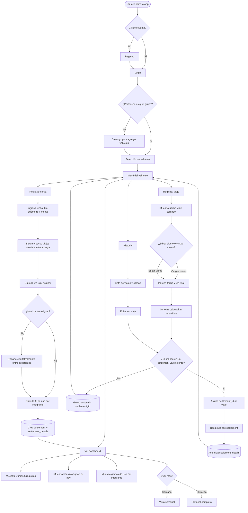

# KmSplit 🚗⛽

> Reparto justo del gasto de combustible en autos compartidos, proporcional a los km recorridos por cada persona.

## Descripción

KmSplit es una aplicación web mobile-first que resuelve un problema muy común en familias o grupos que comparten un mismo auto: **repartir el gasto de combustible de forma justa**, según cuánto manejó realmente cada persona, y no de forma equitativa a ciegas.

La app permite registrar los viajes diarios de cada conductor y las cargas de combustible, calculando automáticamente cuánto le corresponde pagar a cada integrante del grupo en base a los kilómetros recorridos entre carga y carga.

## Problema que resuelve

Cuando varias personas comparten un vehículo (por ejemplo, en una familia), es común que el gasto de combustible se divida en partes iguales sin importar quién usó más el auto. Esto genera injusticias y discusiones. Llevar este control a mano en una planilla de cálculo funciona, pero es incómodo, propenso a errores y difícil de mantener actualizado desde el celular.

KmSplit digitaliza y automatiza ese proceso, ofreciendo:

- Registro rápido de viajes desde el celular (mobile-first)
- Cálculo automático y transparente del reparto proporcional
- Historial y visualización clara del gasto de cada integrante
- Detección de kilómetros no asignados (viajes no registrados) para mantener la trazabilidad

## Funcionalidades (MVP)

- [ ] Registro y login de usuarios
- [ ] Creación de grupos (familia/convivientes) y vehículo asociado
- [ ] Carga de viajes diarios (usuario, km inicial, km final)
- [ ] Carga de combustible (fecha, km del odómetro, monto total)
- [ ] Cálculo automático de liquidación/reparto entre cargas
- [ ] Dashboard con historial y gráficos de gasto por persona
- [ ] Diseño responsive, mobile-first

## Stack tecnológico

**Backend:** Django + Django REST Framework, PostgreSQL    
**Frontend:** Angular, Html, Css, Tailwind    
**Diseño:** Figma    
**Infraestructura:** Docker, Docker Compose    
**Deploy:** Vercel    

## 📂 Estructura del proyecto   

kmsplit/    
├── backend/    
│   ├── Dockerfile  
│   ├── requirements.txt    
│   ├── .env.example    
│   └── (acá vas a correr django-admin startproject)    
├── frontend/   
│   ├── Dockerfile  
│   └── (acá vas a correr ng new)   
├── docker-compose.yml  
├── .gitignore  
└── README.md   

## 📸 Capturas / Demo

> Se agregarán capturas de pantalla de todo el avance del proyecto, como los diagramas de flujo, capturas de los wireframes y el modelo relacional de la base de datos en esta primera estapa.        
>

### 🔄 Diagrama de Flujo

Se documentó el flujo completo de la aplicación, desde el onboarding del usuario hasta la lógica de liquidación automática, incluyendo el circuito de edición de viajes cargados tarde y su impacto en el recálculo del reparto.

💡 **¿Por qué es importante este flujo?**

El punto más delicado del sistema es la liquidación: si un viaje se carga después de que ya se generó el reparto de una carga de combustible, el sistema lo detecta, lo asocia al período correspondiente y **recalcula automáticamente** cuánto le toca pagar a cada integrante — sin intervención manual.

> 
> 🎨 **Paleta de colores**       
Gama de azules y grises pensada para transmitir claridad y confianza, con acentos puntuales (ámbar para alertas, verde para confirmaciones) que ayudan al usuario a identificar rápido el estado de sus registros.
> 
Ver paleta completa:     
>         
Link al Figma: https://www.figma.com/design/laSA5OAyx2tbP8l0ezerSE/KmSplit?node-id=0-1&t=eRqsWqXdQEigd7KL-1    

📱 **Wireframes (Mobile-First)**    
Antes de escribir código se diseñaron los wireframes de baja fidelidad de las 9 pantallas del MVP, priorizando un flujo mobile-first ya que la carga de datos (viajes y combustible) se hace principalmente desde el celular, al lado del auto.    
    
Ver wireframes: 
> 
> Login, Registro y Recuperar contraseña    
> 
>     

> Seleccion de vehículo, Menú del vehículo y Registrar viaje    
> 
>       

> Registro de carga, Resumen y Historial semanal    
> 
>     

📂 Estructura de la Base de Datos      
Para este proyecto se diseñó el Modelo Relacional utilizando dbdiagram.io, una potente herramienta basada en DBML (Database Markup Language). Este enfoque de "arquitectura como código" permite mantener la documentación visual perfectamente sincronizada con la estructura lógica del sistema.

💡 ¿Por qué se incluye este modelo y para qué sirve?
- Claridad del Dominio: Permite entender de un vistazo cómo interactúan las entidades críticas del sistema (como users, vehicles, groups y trips).
- Integridad de Datos: Documenta de forma explícita las relaciones de la base de datos, definiendo las claves primarias (pk) y foráneas (fk) que aseguran la consistencia de la información.
- Mantenibilidad Extensible: Al estar escrito en código DBML, cualquier cambio futuro en el modelo se puede versionar en Git de la misma manera que el código fuente de la aplicación.
- Agilidad en el Desarrollo: Sirve como una guía visual directa para escribir las migraciones, modelos o consultas en el backend sin lugar a ambigüedades.

Link al Diagrama del Modelo Relacional: https://dbdiagram.io/d/KmSplit-6a5079094ac62e474c724e47     

## Roadmap

- [x] Definición del proyecto y modelo de datos
- [x] Wireframes mobile-first
- [x] Modelos y lógica de backend
- [ ] CRUD básico (viajes, cargas, grupos)
- [ ] Lógica de liquidación/reparto
- [ ] Frontend mobile-first
- [ ] Deploy
- [ ] Funcionalidades extra (invitar por link, exportar PDF, multi-vehículo)

## 👤 Autor

**Mariano** — Estudiante de la Tecnicatura Superior en Desarrollo de Software (TSDS), ISPC, Córdoba, Argentina.
Full Stack Developer Jr en formación | [LinkedIn](www.linkedin.com/in/mariano-casarino) | [Portfolio](https://github.com/marian-casa)

## 📄 Licencia

Este proyecto es de código abierto y fue creado con fines de portfolio y aprendizaje.
